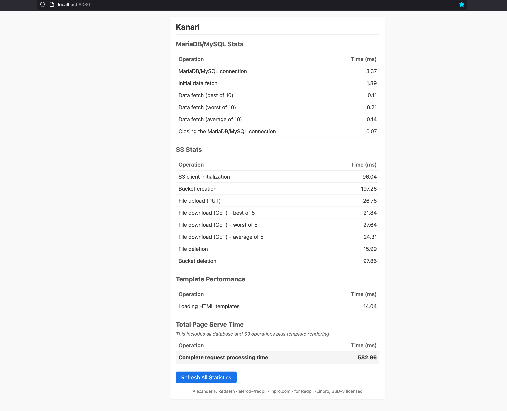

</img>

# Kanari

MariaDB/MySQL, PostgreSQL, S3 and HTTP benchmark/status application for the Cloud, that uses Python and Flask.

All services have 3 seconds to respond. If they time out, `504 Gateway Timeout` is returned.

### Screenshot

Of the previous version, before PostgreSQL support was added:

### Environment variables

#### Database (MariaDB/MySQL)

- `DB_HOST` – Hostname of the MySQL/MariaDB server
- `DB_PORT` – Port (default: 3306)
- `DB_NAME` – Database name
- `DB_USER` – Username
- `DB_PASSWORD` – Password
- `DB_TABLE` – Database table (optional, defaults to `DB_NAME`)

#### PostgreSQL

- `PG_HOST` – Hostname of the PostgreSQL server
- `PG_PORT` – Port (default: 5432)
- `PG_DATABASE` – Database name
- `PG_USER` – Username
- `PG_PASSWORD` – Password
- `PG_TABLE` – Database table (optional, defaults to `PG_DATABASE`)

#### S3

- `S3_ACCESS_KEY` – S3 access key
- `S3_SECRET_KEY` – S3 secret key
- `S3_ENDPOINT` – Custom S3 endpoint URL
- `S3_BUCKET` – S3 bucket to use for performance tests

#### HTTP / App
- `HOST` – Host to bind the Flask server (default: `0.0.0.0`)
- `PORT` – Port to bind the Flask server (default: `5000`)

### General info

* Version: 1.3.1
* License: BSD-3
